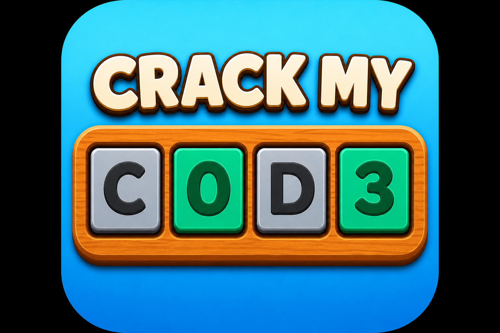

<p align="center">
  
</p>

# Crack My Code

A competitive **code-cracking duel** built on **Celo**, playable in the browser and inside **MiniPay** / Farcaster mini apps. Two players each hide a secret 4-digit code; whoever cracks the opponent’s code first wins.

<p align="center">
  <video src="apps/web/public/crack-my-code.mp4" controls width="720" poster="apps/web/public/logo.png">
    Your browser does not support the video tag.
  </video>
</p>

## How the game works

1. **Set your code** — Pick a secret 4-digit code (digits 0–9, repeats allowed, e.g. `1122`).
2. **Take turns guessing** — Submit guesses against your opponent’s hidden code.
3. **Read the clues** — Each guess is colored Wordle-style:
   - **Green** — correct digit, correct position
   - **Yellow** — digit is in the code, wrong position
   - **Gray** — digit is not in the code (duplicate tiles may show darker gray when you’ve already used all copies)
4. **Win** — First to crack the opponent’s code wins (up to 8 guesses per side).

## Game modes

| Mode | Status | Description |
|------|--------|-------------|
| **Cipher AI** | Live | Play against **Cipher**, an entropy-based AI that narrows 10,000 possible codes using logic, not random guesses. |
| **Friendly (PvP)** | Live | Free human vs human — public matchmaking or **invite-only** with a shareable **Game ID**. |
| **Professional (USDT)** | Coming soon | Staked USDT matches on Celo; winner takes ~99% of the pool. |

### Private challenges (Game ID)

1. Host creates an **invite-only** friendly match on **Home**.
2. Host copies the **Game ID** (e.g. `K7M3NP2X`) from the waiting screen.
3. Friend opens **Open** → **Join Challenge**, pastes the ID, and joins.
4. Both players set their codes; the match starts when both lock in.

## Cipher AI

Cipher is documented in:

- [`apps/web/docs/cipher-ai-strategy.md`](apps/web/docs/cipher-ai-strategy.md) — how the live solver works
- [`apps/web/cipher.md`](apps/web/cipher.md) — architecture overview
- [`apps/web/src/lib/cipher.ts`](apps/web/src/lib/cipher.ts) — implementation

High level: maintain all valid codes, eliminate inconsistent secrets after each guess, then pick probes that maximize information (entropy + minimax), with opening book `0123` → `4567`.

## Getting started

### Prerequisites

- Node.js 18+
- PNPM 8+
- PostgreSQL (for game state) — see `apps/web/.env.template`

### Install & run

```bash
pnpm install
cd apps/web && cp .env.template .env   # configure DATABASE_URL, Pusher, etc.
pnpm dev
```

Open [http://localhost:3000](http://localhost:3000).

## Deploy on Vercel

This repo is a pnpm + Turborepo monorepo. The Next.js app lives in `apps/web`.

1. Import the repo in Vercel (root directory = repository root, not `apps/web`).
2. Build uses `vercel.json`: `pnpm turbo build --filter=web` → output `apps/web/.next`.
3. Set environment variables from `apps/web/.env.template` (`DATABASE_URL`, Pusher keys, Privy, etc.).
4. Optional: set **Root Directory** to `apps/web` instead — then use **Build Command** `prisma generate && next build` and **Install Command** `cd ../.. && pnpm install`.

## Project structure

| Path | Purpose |
|------|---------|
| `apps/web` | Next.js app — UI, API routes, Prisma, Cipher AI |
| `apps/contracts` | `GuessMyCode` smart contract (Hardhat) |
| `apps/promo-video` | Remotion promo for social |

## Scripts

| Command | Description |
|---------|-------------|
| `pnpm dev` | Start dev servers (Turborepo) |
| `pnpm build` | Production build |
| `pnpm video:studio` | Remotion preview |
| `pnpm video:render` | Render promo MP4 |
| `pnpm contracts:compile` | Compile Solidity |
| `pnpm contracts:deploy:celo-sepolia` | Deploy to Celo Sepolia |

## Tech stack

- **Frontend:** Next.js 14, React, Tailwind, Framer Motion
- **Chain:** Celo, USDT, Viem / Wagmi, Privy smart wallets
- **Backend:** Prisma + PostgreSQL, Pusher for realtime PvP
- **AI:** Custom constraint + entropy solver (`cipher.ts`)
- **Video:** Remotion

## Learn more

- [Celo docs](https://docs.celo.org/)
- [MiniPay](https://docs.celo.org/build-on-celo/build-on-minipay)
- [Remotion](https://www.remotion.dev/docs/)

## License

Private / project-specific — see repository owner for terms.
