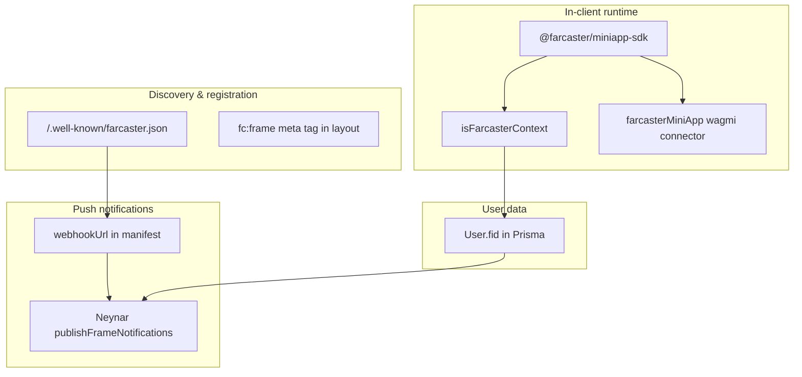

# Farcaster Mini-App Integration

Guide to how Earnbase is implemented as a Farcaster mini-app in `packages/react-app`, including manifest setup, embed metadata, SDK runtime, wallet integration, and push notifications.

**Production URL:** https://earnbase.vercel.app  
**Farcaster listing:** https://farcaster.xyz/miniapps/te_I8X6QteFo/earnbase

---

## Architecture overview

The Farcaster integration has four layers:



| Layer | Purpose |
|-------|---------|
| Manifest | Domain-level registration at `/.well-known/farcaster.json` |
| Embed | Page-level sharing metadata in HTML `<head>` |
| SDK + wallet | Detect Farcaster context, connect wallet, register users |
| Notifications | Neynar push via webhook + stored FIDs |

---

## Related files

| Path | Role |
|------|------|
| `public/.well-known/farcaster.json` | Mini-app manifest (identity, webhook, domain verification) |
| `lib/FarcasterMetadata.ts` | Embed metadata for social sharing |
| `app/layout.tsx` | Injects `fc:frame` meta tag |
| `app/page.tsx` | Landing page; Farcaster detection + `sdk.actions.ready()` |
| `app/Start/page.tsx` | Main home; auto wallet connect + FID registration |
| `app/context/isFarcasterContext.tsx` | React context for `isFarcaster` flag |
| `providers/AppProvider.tsx` | Wagmi config with `farcasterMiniApp()` connector |
| `lib/FarcasterNotify.ts` | Neynar notification helpers |
| `lib/Prismafnctns.ts` | `getAllUserFids()`, `getAllFarcasterUsers()`, `registerUser()` |
| `scripts/test-farcaster-notify.ts` | Manual notification test script |
| `next.config.js` | CORS headers for `/.well-known/*` |

---

## 1. Manifest (`public/.well-known/farcaster.json`)

Served at `https://earnbase.vercel.app/.well-known/farcaster.json`.

### Current contents

```json
{
  "frame": {
    "name": "Earnbase",
    "version": "1",
    "iconUrl": "https://earnbase.vercel.app/logo.png",
    "homeUrl": "https://earnbase.vercel.app",
    "imageUrl": "https://earnbase.vercel.app/logo.png",
    "splashImageUrl": "https://earnbase.vercel.app/logo.png",
    "splashBackgroundColor": "#C5CAE9",
    "webhookUrl": "https://api.neynar.com/f/app/d99795a5-172e-44be-a4a8-328a85bc224e/event",
    "subtitle": "Task-Reward Platform",
    "description": "Complete tasks and earn rewards in USDC.",
    "primaryCategory": "finance"
  },
  "accountAssociation": {
    "header": "...",
    "payload": "...",
    "signature": "..."
  }
}
```

### What is configured

- **Domain verification** via `accountAssociation` (FID `1077932`, domain `earnbase.vercel.app`)
- **Required fields:** `name`, `version`, `iconUrl`, `homeUrl`
- **Neynar webhook** for notification token capture when users add the mini-app
- **CORS** enabled in `next.config.js` for `/.well-known/:path*`

### Manifest issues to be aware of

| Issue | Detail |
|-------|--------|
| `frame` vs `miniapp` key | Current Farcaster/Neynar spec prefers `"miniapp": { ... }`. The `frame` key is legacy but still accepted. |
| `logo.png` not in repo | Manifest references `logo.png`; the repo only has `public/logo.svg`. Production serves `logo.png` correctly, but local dev may differ. |
| Not documented elsewhere | `docs/well-known-manifests.md` covers agent-card and MCP manifests only — not `farcaster.json`. |

### Regenerating `accountAssociation`

Use the [Farcaster Mini App Manifest Tool](https://farcaster.xyz/~/developers/mini-apps/manifest) in Warpcast:

1. Enter domain `earnbase.vercel.app`
2. Sign with the Farcaster custody address
3. Copy the signed `accountAssociation` block into `farcaster.json`
4. Deploy and verify `GET /.well-known/farcaster.json` returns HTTP 200

---

## 2. Embed metadata (page-level sharing)

Defined in `lib/FarcasterMetadata.ts` and injected via `app/layout.tsx`:

```ts
// lib/FarcasterMetadata.ts
export const fcEmbed = {
  version: "next",
  imageUrl: "https://earnbase.vercel.app/bg_image_last.png",
  button: {
    title: "🧠Submit feedback get Rewards",
    action: {
      type: "launch_frame",
      name: "Earnbase: AI Feedback & Rewards",
      url: "https://earnbase.vercel.app",
      splashImageUrl: "https://earnbase.vercel.app/logo.png",
      splashBackgroundColor: "#C5CAE9",
    },
  },
};
```

```ts
// app/layout.tsx
export const metadata: Metadata = {
  other: {
    "fc:frame": JSON.stringify(fcEmbed),
  },
};
```

### Manifest vs embed

| | Manifest | Embed |
|---|----------|-------|
| Location | `/.well-known/farcaster.json` | `fc:frame` meta tag in HTML |
| Scope | One per domain | Per shareable page |
| Controls | App identity, webhook, domain verification | Social card preview when a URL is shared |
| Required for notifications | Yes | No |
| Required for feed sharing | No | Yes |

### Embed issues to be aware of

| Issue | Detail |
|-------|--------|
| `fc:frame` vs `fc:miniapp` | Current spec uses `fc:miniapp` in HTML `<head>`. Earnbase uses the legacy `fc:frame` format. |
| `launch_frame` vs `launch_miniapp` | Action type is legacy; current spec uses `launch_miniapp`. |
| Inconsistent images | Manifest uses `logo.png`; embed preview uses `bg_image_last.png`. |

---

## 3. Mini-app SDK runtime

### Dependencies

| Package | Status |
|---------|--------|
| `@farcaster/miniapp-sdk` | Used — context detection, `ready()`, `addFrame()` |
| `@farcaster/miniapp-wagmi-connector` | Used — Farcaster wallet connector |
| `@farcaster/frame-sdk` | Listed in `package.json` but **not imported anywhere** |

### Landing page (`app/page.tsx`)

- Detects Farcaster via `sdk.context`
- Calls `sdk.actions.ready()` and `sdk.actions.addFrame()` before navigation
- Skips welcome screen for returning users via `localStorage` key `earnbase_has_seen_welcome`

### Start page (`app/Start/page.tsx`)

- Re-detects Farcaster context and stores `fcDetails` (fid, username, displayName)
- Auto-connects wallet via `connectors[1]` (assumed to be the Farcaster connector)
- Auto-registers users with their FID when running inside Farcaster

### Runtime gaps

| Gap | Impact |
|-----|--------|
| `sdk.actions.ready()` only on `/` | Users landing directly on `/Start` or other routes may see a longer loading splash |
| `addFrame()` instead of `addMiniApp()` | Uses legacy SDK API name |
| `connectors[1]` magic index | Fragile if connector order changes in `AppProvider.tsx` |

---

## 4. Wallet integration

```ts
// providers/AppProvider.tsx
export const wagmiConfig = createConfig({
  chains: [celo],
  connectors: [
    ...connectors,       // RainbowKit injected wallet (index 0)
    farcasterMiniApp(), // Farcaster connector (index 1)
  ],
});
```

In Farcaster, `Start/page.tsx` calls `connect({ connector: connectors[1] })`. Outside Farcaster, MiniPay/MetaMask injection is used instead.

---

## 5. Farcaster context

`app/context/isFarcasterContext.tsx` provides a global `isFarcaster` flag.

**Consumers:**

- `app/Start/page.tsx` — auto wallet connect + FID registration
- `components/FormGenerator.tsx` — after payment, Farcaster users skip the rating modal and return to `/Start`

---

## 6. User registration & FID storage

When a user connects inside Farcaster (`app/Start/page.tsx`):

1. `sdk.context` provides `fid`, `username`, `displayName`
2. `registerUser(username, fid, walletAddress, null)` is called if no existing user
3. FID is stored on the `User` model (`prisma/schema.prisma` → `fid Int?`)

FID is required for push notifications. Users who connect only via browser/MetaMask without a FID cannot receive Farcaster notifications.

---

## 7. Push notifications (Neynar)

### Flow

1. User adds the mini-app in a Farcaster client
2. Farcaster client hits `webhookUrl` in the manifest
3. Neynar captures a notification token for that FID
4. App sends notifications via `publishFrameNotifications` using stored FIDs

### Implementation (`lib/FarcasterNotify.ts`)

| Function | Purpose |
|----------|---------|
| `sendFarcasterNotification(fids, title, message)` | Core send; truncates body to 128 chars |
| `notifyAllUsersOfNewTask(amount)` | Batches all FIDs (100 per batch) for new task alerts |
| `notifyUserOfPayment(fid, amount)` | Payment received notification to a single user |

**`target_url`:** Always `https://earnbase.vercel.app` (no trailing slash, matching manifest `homeUrl`).

### Trigger points

| Location | Event |
|----------|-------|
| `app/CreateTask/page.tsx` | Human-created task |
| `lib/Prismafnctns.ts` | Task creation helper |
| `app/api/agent/submit/route.ts` | Agent-submitted task (non-blocking) |
| `components/FormGenerator.tsx` | Payment received after task completion |
| `core/taskPublisher.ts` | Alternate publish path |

### Environment

Requires `NEYNAR_API_KEY` in `.env`. Not currently listed in `.env.example`.

### Testing

```bash
cd packages/react-app
npx tsx scripts/test-farcaster-notify.ts
```

Default target FID in the script: `1077932` (manifest owner FID).

### Common notification failures

From `scripts/test-farcaster-notify.ts`:

1. User has not added the mini-app yet
2. User has disabled notifications for this app
3. Manifest (`farcaster.json`) has not been refreshed by the Farcaster client yet
4. `webhookUrl` was recently changed and Neynar has not captured a token for that FID yet

Neynar may return `NoNotificationTokens` for entire batches when no users in the batch have launched the frame. `notifyAllUsersOfNewTask` logs a warning and continues.

---

## 8. Status summary

### Working

- [x] Manifest live, signed, and domain-verified at `/.well-known/farcaster.json`
- [x] Neynar webhook URL configured in manifest
- [x] SDK detection, wallet connect, and FID registration in Farcaster
- [x] Notification pipeline wired end-to-end
- [x] CORS for `.well-known` paths

### Known issues / recommended fixes

| Priority | Issue | Recommended fix |
|----------|-------|-----------------|
| Medium | Legacy `frame` key in manifest | Rename to `miniapp` per current spec |
| Medium | Legacy `fc:frame` embed | Change to `fc:miniapp` and `launch_miniapp` |
| Medium | Legacy `addFrame()` SDK call | Use `addMiniApp()` |
| Medium | `ready()` only on landing page | Call `sdk.actions.ready()` early on `/Start` and other entry routes |
| Low | `logo.png` missing from repo | Add `public/logo.png` or update URLs to `logo.svg` |
| Low | Unused `@farcaster/frame-sdk` | Remove from `package.json` |
| Low | `NEYNAR_API_KEY` not in `.env.example` | Document required env var |
| Low | Duplicate FID helpers | Consolidate `getAllUserFids()` and `getAllFarcasterUsers()` |

---

## 9. Notification checklist

For notifications to reach a specific user:

- [ ] User added the mini-app in a Farcaster client (Warpcast, etc.)
- [ ] `webhookUrl` in manifest matches the Neynar app ID
- [ ] `NEYNAR_API_KEY` is set in production environment
- [ ] User's `fid` is stored in the database (Farcaster registration flow)
- [ ] Manifest changes have had time to propagate in Farcaster clients

---

## 10. Deployment verification

After manifest or embed changes:

1. Confirm JSON is valid (no trailing commas)
2. Confirm CORS headers apply (`next.config.js` → `/.well-known/:path*`)
3. Smoke-test:
   - `GET https://earnbase.vercel.app/.well-known/farcaster.json` → HTTP 200
   - `GET https://earnbase.vercel.app/logo.png` → HTTP 200, `content-type: image/png`
   - View page source → `fc:frame` meta tag present
4. Re-add the mini-app in Warpcast if `webhookUrl` changed
5. Run `scripts/test-farcaster-notify.ts` against a known FID

---

## 11. External references

- [Farcaster Mini Apps — Manifest vs Embed](https://miniapps.farcaster.xyz/docs/guides/manifest-vs-embed)
- [Neynar — Convert web app to mini app](https://docs.neynar.com/docs/convert-web-app-to-mini-app)
- [Neynar — Send notifications to mini app users](https://docs.neynar.com/docs/send-notifications-to-mini-app-users)
- [Farcaster Mini App Manifest Tool](https://farcaster.xyz/~/developers/mini-apps/manifest)
